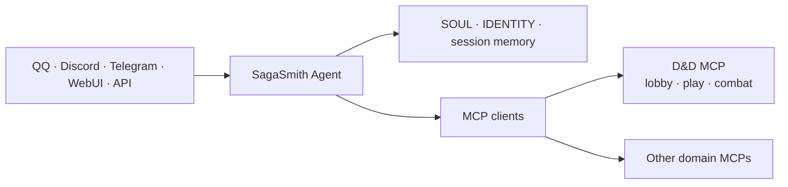

# SagaSmith Agent

[中文](README.md) · [English](README-en.md) · [Website](https://sagasmithai.github.io) · [Platform overview](https://github.com/SagaSmithAI/.github/blob/main/profile/README.md) · [SagaSmith Web](https://github.com/SagaSmithAI/SagaSmith-service) · [Content catalog](https://github.com/SagaSmithAI/SagaSmith-dnd-content-library)

<p align="center"></p>

**The identity, session, and multi-channel Agent Host for SagaSmithAI.** Built on [NanoBot](https://github.com/HKUDS/nanobot), it connects models, chat channels, workspace identity, memory, and MCP services. Domain rules, books, modules, and campaign databases belong to independent MCP servers.

> The Agent is the GM at the table, not a second backend that secretly copies every rules engine.

## Platform responsibility



SagaSmith Agent owns trusted channel identity, the multi-turn agent loop, workspace/persona, session memory and compaction, model/provider adapters, channel integrations, scheduling, long tasks, subagents, built-in tools, WebUI, and an optional OpenAI-compatible API.

It does **not** write D&D/CoC databases directly, reimplement rules/combat/module parsing, infer permission from display names, or bypass a matching MCP workflow with a CLI or temporary script.

## MCP 2026-07-28 and the Hosted boundary

The bundled release lock requires Python SDK v2 and MCP 2026-07-28. Generic MCP configuration
can still use `protocolMode: "auto"` to fall back to legacy initialize, and `"legacy"` remains an
explicit operational rollback. The modern path sends no `Mcp-Session-Id`. Every call carries a short-lived
`sagasmith.auth-context/v2` delegation bound to the target MCP, workload, requester, resource
owner, acting Host/character, audience, concrete operations, `room_turn_id`, and `base_revision`.
Hosted Worker requires a dedicated `SAGASMITH_WORKER_SERVICE_TOKEN`, keeps trusted context
structurally separate from player text, and connects only the MCP for the current `system_id`.
Standard MCP text/image/audio/resource/embedded-resource results are retained while `host_media`
envelopes feed the Web artifact pipeline.

## D&D: the MCP-first path

The D&D MCP in [sagasmith-dnd](https://github.com/SagaSmithAI/sagasmith-dnd) owns campaigns, rules, modules, characters, knowledge, branches, snapshots, and combat. Its modern catalogue is deterministic for the same authorization and carries private cache hints. The Agent selects a bounded facade subset for the current system, phase, and task; each call still revalidates identity, role, phase, revision, and allowed operation at the MCP.

```text
inbound message
→ Host injects principal
→ skill_query(read/search/section) for bounded Skill sections
→ read the stable, bounded MCP catalogue
→ select exact facade tool IDs for this system / phase / task
→ pass explicit campaign / revision / server-issued guidance handle
→ call the selected native MCP tool directly
→ MCP validates phase / campaign / role / actor / revision
→ a first or changed host_context_binding causes an in-turn hard barrier
→ isolated_evaluate / portray_npc returns a proposal from a fresh zero-tool context
→ result returns to session and channel
```

Modern catalogue contents never change as a side effect of another request on the same connection. Authorization can still produce a private deterministic catalogue, while legacy `tools/list_changed` remains only for compatibility and real catalogue changes. Neither catalogue selection nor an opaque handle grants authority.

When campaign, principal, role, audience, branch, or restore state changes, the
Agent stops later calls from the same model response and rebuilds without old
messages, summaries, workspace/Dream memory, cached retrieval, or receipts.
`isolated_evaluate` uses fixed schemas for actor, audience, faction, source, and
DM-ruling proposals and can evaluate independent signed bundles concurrently;
`portray_npc` retains the richer named-NPC dialogue contract. Both run without
tools or child-session persistence and neither can author authoritative state.
NPC bundle v2 carries an MCP-owned structured conversation and a fixed
host-neutral delegation contract, never the Agent channel transcript.

### Shareable content remains MCP-owned

The Agent does not parse, rewrite, or cache a second creature catalog. Unified
PC/NPC/monster actor cards, bundled SRD preset packs, and module packages with a
Scene Atlas, assets, reviewed content, and pregenerated actors are imported and
exported through D&D MCP Lobby exposures. Imports return fresh actor ids. The
Agent must discard source database identity and must not copy old session,
workspace, or ActorKnowledge context into the new actor. A chat attachment may
transport a package, but only MCP validation, allowlisted file access, and public
transactions can place it in a campaign.

## Install and start the full Windows workspace

Requirements are Windows 11, [uv](https://docs.astral.sh/uv/), Python 3.11+, and Node.js 22.12+ with npm. Keep the current SagaSmith repositories as siblings; see the [full Windows workspace guide](docs/guides/install-full-workspace-windows.md) for the complete layout, component boundaries, and troubleshooting.

```text
SagaSmith/
  SagaSmith-agent/              # Agent, channels, and WebUI
  sagasmith-core/               # neutral persistence and Pack infrastructure
  sagasmith-dnd/                # D&D Domain, MCP, Skills, UI, and module generator
  sagasmith-coc/                # CoC Domain, MCP, Skills, UI, and module generator
  sagasmith-narrative/          # Narrative Domain, MCP, Skills, and project generator
  SagaSmith-dnd-content-library/# public catalog with per-Pack rights (optional)
```

The three domain repositories are the only current source entry points for
Domain, MCP, Skills, UI where present, and authoring workflows. The former
standalone MCP, Skills, UI, and generic Module Generator repositories are
archived; the installer neither reads them nor treats them as fallbacks.

The bundled `sagasmith.release-lock/v3` pins Core and all three active domain repositories to
audited immutable commits. It also records MCP 2026-07-28, auth-context v2, and the shared
authority contract as required compatibility metadata. Unknown components are rejected, so an
archived split repository cannot silently become a release input.
The manifest is an unpublished compatibility lock, not a release announcement or tag.

Install a named release profile from the Agent repository. `--mode` remains
available for custom combinations; omitting both selects `multi-system`:

```powershell
cd SagaSmith-agent
uv run nanobot sagasmith install --profile dnd-only
uv run nanobot sagasmith install --profile coc-only
uv run nanobot sagasmith install --profile narrative-only
uv run nanobot sagasmith install --profile multi-system
uv run nanobot sagasmith install --mode coc --mode narrative
uv run nanobot sagasmith install
```

`sagasmith-local-kit.json` fixes the profiles, components, ports, templates, and
shared `sagasmith.authoritative-mcp/v2` contract. Every profile supports
`--transport stdio`, `--transport streamable-http`, or the backward-compatible
`mixed` default. Both transports use the same handlers, schemas, errors,
revisions, idempotency, and authority semantics; HTTP remains loopback-only.

The Python installer keeps D&D, CoC, and Narrative optional and independently
versioned. It reconciles only SagaSmith-owned config fields, builds only
selected UIs, never imports or activates a Pack, and does not depend on
SagaSmith Web, PostgreSQL, Redis, object storage, accounts, quota, or Forge.

Create the repo-local Agent configuration after installation:

```powershell
uv run nanobot onboard --wizard --config config\config.json --workspace workspace
```

Then follow the [MCP configuration guide](docs/guides/configure-mcp-tools.md). Re-audit an existing installation with:

```powershell
uv run nanobot sagasmith install --verify-only
uv run nanobot sagasmith doctor --json
```

Doctor reports MCP/config, domain databases, Skills, provider readiness, and
the selected transport separately. Credential-free Discord, QQ, Telegram,
Codex, Claude Code, OpenClaw, and generic Agent templates live in
[`examples/local-agent-kit`](examples/local-agent-kit/README.md).

The local performance baseline does not call an LLM or open existing campaign
data. It starts one loopback MCP at a time in a temporary directory and records
cold start, warm `server_capabilities` calls in one session, and idle RSS:

```powershell
uv run nanobot sagasmith benchmark --profile dnd-only --iterations 5 --json
```

The friendly D&D and CoC embedding-cache paths map to Core's
`DND5E_EMBEDDING_CACHE_DIR` and `COC7_EMBEDDING_CACHE_DIR`. Narrative's template
entry is reserved only: the current Narrative runtime does not use the Core
embedder and must not be treated as cache-enabled.

The installer syncs only the Agent base and selected MCP packages; D&D/CoC add
the `gateway` extra only for HTTP profiles. It does not install every Agent
channel extra. Select Bot channels after installation, for example with
`uv sync --extra discord`, `--extra qq`, or `--extra telegram`. Domain MCP
document/OCR requirements still follow each package's current contract.

After configuration passes, start the selected services and Agent:

```powershell
uv run nanobot sagasmith start
```

The committed public catalog contains only redistributable SRD Packs. A complete private library must be built locally from books the user owns through the current draft → Agent review → finalize flow. The installer does not copy commercial sources, generate private Packs, or choose campaign activation; import and activation remain Lobby content-control operations.

D&D and CoC Workbenches use ports 8766 and 8768. Non-loopback access requires an explicit bearer token and origin allowlist. Keep machine paths and secrets out of Git and reference provider keys through environment variables.

## Generic quick start

Requires Python 3.11+:

```bash
uv sync
uv run nanobot onboard --wizard
uv run nanobot status
uv run nanobot agent -m "Hello"
```

Or inside a controlled virtual environment:

```bash
python -m pip install -e .
nanobot onboard --wizard
nanobot gateway
```

## MCP rules

- Use stdio for trusted local servers. HTTP/SSE is protected by the shared SSRF guard; private targets require narrow allowlisting.
- `enabledTools` is the Host's outer allowlist. Domain phase, role, and exposure should narrow access again on the server.
- `injectPrincipal` authenticates the caller field; grant targets remain model-visible and separate.
- Domain MCPs own persistence and domain Skills. The Agent workspace owns persona, sessions, and cross-domain orchestration.
- Finalized unified Packs are domain content, not Host session memory or permission carriers.

## Memory layers

| Layer | Owner | Purpose |
|---|---|---|
| Session history | Agent | recent chat continuity |
| Dream/compaction | Agent | compressed long-conversation context |
| Campaign snapshots/branches | Domain runtime | authoritative restorable world timelines |
| Campaign memory | Domain MCP/Core | branch-aware facts across sessions |
| Actor knowledge | Domain MCP/Core | independent PC/NPC knowledge and visibility |

In domain-authoritative campaign context, workspace/Dream memory is excluded
from the model prompt and campaign messages are classified `campaign_private`
inside their session. Agent summaries never replace authoritative campaign
state and must not leak GM-only facts into player-visible sessions.

## Development

```bash
uv sync --all-extras
uv run pytest
uv run ruff check nanobot tests

cd webui
bun install
bun run build
bun run test
```

Docs: [Quick Start](docs/quick-start.md) · [Configuration](docs/configuration.md) · [Architecture](docs/architecture.md) · [MCP](docs/guides/configure-mcp-tools.md) · [Security](SECURITY.md)

## Status and license

Active Alpha. SagaSmith-specific work is licensed under Apache-2.0. NanoBot upstream and other third-party components retain their respective licenses, attribution, and notices; see [THIRD_PARTY_NOTICES.md](THIRD_PARTY_NOTICES.md).
