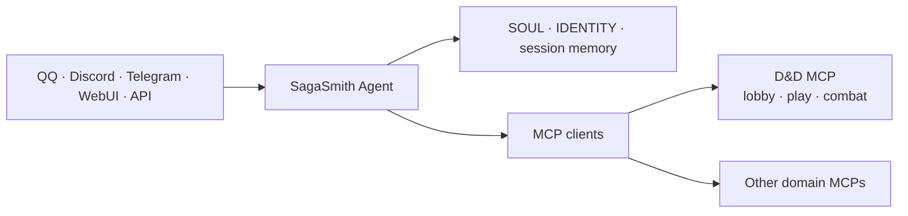

# SagaSmith Agent

[中文](README.md) · [English](README-en.md) · [Platform overview](https://github.com/SagaSmithAI/.github/blob/main/profile/README.md)

<p align="center"></p>

**The identity, session, and multi-channel Agent Host for SagaSmithAI.** Built on [NanoBot](https://github.com/HKUDS/nanobot), it connects models, chat channels, workspace identity, memory, and MCP services. Domain rules, books, modules, and campaign databases belong to independent MCP servers.

> The Agent is the GM at the table, not a second backend that secretly copies every rules engine.

## Platform responsibility



SagaSmith Agent owns trusted channel identity, the multi-turn agent loop, workspace/persona, session memory and compaction, model/provider adapters, channel integrations, scheduling, long tasks, subagents, built-in tools, WebUI, and an optional OpenAI-compatible API.

It does **not** write D&D/CoC databases directly, reimplement rules/combat/module parsing, infer permission from display names, or bypass a matching MCP workflow with a CLI or temporary script.

## D&D: the MCP-first path

[SagaSmith D&D MCP](https://github.com/SagaSmithAI/SagaSmith-dnd-mcp) owns campaigns, rules, modules, characters, knowledge, branches, snapshots, and combat. The Agent keeps only 13 exposure, diagnostic, and bounded Skill-read tools enabled. Every chat session opens its own server-side exposure and loads a narrow `lobby`, `play`, or `combat` group.

```text
inbound message
→ Host injects principal
→ skill_query(plan) and read required_now
→ exposure_open
→ search / inspect / load and read skill_plan_delta
→ exposure_call (NanoBot static-schema fallback)
→ MCP validates phase / campaign / role / actor / revision
→ a first or changed host_context_binding causes an in-turn hard barrier
→ isolated_evaluate / portray_npc returns a proposal from a fresh zero-tool context
→ result returns to session and channel
```

One MCP process can therefore maintain different tool surfaces for different channels, users, and campaigns, without trusting model-supplied authority.

When campaign, principal, role, audience, branch, or restore state changes, the
Agent stops later calls from the same model response and rebuilds without old
messages, summaries, workspace/Dream memory, cached retrieval, or receipts.
`isolated_evaluate` uses fixed schemas for actor, audience, faction, source, and
DM-ruling proposals and can evaluate independent signed bundles concurrently;
`portray_npc` retains the richer named-NPC dialogue contract. Both run without
tools or child-session persistence and neither can author authoritative state.
NPC bundle v2 carries an MCP-owned structured conversation and a fixed
host-neutral delegation contract, never the Agent channel transcript.

### Shareable content remains MCP-owned

The Agent does not parse, rewrite, or cache a second creature catalog. Unified
PC/NPC/monster actor cards, bundled SRD preset packs, and module packages with a
Scene Atlas, assets, reviewed content, and pregenerated actors are imported and
exported through D&D MCP Lobby exposures. Imports return fresh actor ids. The
Agent must discard source database identity and must not copy old session,
workspace, or ActorKnowledge context into the new actor. A chat attachment may
transport a package, but only MCP validation, allowlisted file access, and public
transactions can place it in a campaign.

## Start the full Windows workspace

[`start.bat`](start.bat) is the single Agent + D&D MCP + D&D UI Gateway entry point. NanoBot starts the stdio MCP as a child process; the script also starts a principal-aware HTTP/SSE adapter on `127.0.0.1:8766`.

Expected sibling layout:

```text
SagaSmith/
  SagaSmith-agent/
  SagaSmith-dnd-mcp/
  SagaSmith-dnd-skills/
  SagaSmith-module-gen-skills/
  reference/DnD-Books/
```

```powershell
cd SagaSmith-dnd-mcp
uv sync --all-extras

cd ..\SagaSmith-coc-mcp
uv sync --all-extras

cd ..\SagaSmith-agent
uv sync --all-extras
# configure provider, model, channels, and both SagaSmith MCP servers
.\start.bat
```

The script checks `uv`, the local config, Full D&D Skills exposure and its
phase plan, the D&D core-tool allowlist, the 900-second PDF timeout, separate
rulebook and campaign-module import allowlists, and both sibling MCP
executables. It prepares their workspace homes, waits for the D&D UI Gateway
health check, and then starts the foreground Agent gateway. It stops the UI
adapter when the Agent exits. See [the MCP guide](docs/guides/configure-mcp-tools.md).
Keep machine paths and secrets out of Git; reference provider keys through
environment variables.

The UI connects to `http://127.0.0.1:8766` by default. Non-loopback access requires an explicit bearer token and origin allowlist; without a token, the adapter rejects remote requests.

## Generic quick start

Requires Python 3.11+:

```bash
uv sync
uv run nanobot onboard --wizard
uv run nanobot status
uv run nanobot agent -m "Hello"
```

Or inside a controlled virtual environment:

```bash
python -m pip install -e .
nanobot onboard --wizard
nanobot gateway
```

## MCP rules

- Use stdio for trusted local servers. HTTP/SSE is protected by the shared SSRF guard; private targets require narrow allowlisting.
- `enabledTools` is the Host's outer allowlist. Domain phase, role, and exposure should narrow access again on the server.
- `injectPrincipal` authenticates the caller field; grant targets remain model-visible and separate.
- Domain MCPs own persistence and domain Skills. The Agent workspace owns persona, sessions, and cross-domain orchestration.
- Finalized unified Packs are domain content, not Host session memory or permission carriers.

## Memory layers

| Layer | Owner | Purpose |
|---|---|---|
| Session history | Agent | recent chat continuity |
| Dream/compaction | Agent | compressed long-conversation context |
| Campaign snapshots/branches | Domain runtime | authoritative restorable world timelines |
| Campaign memory | Domain MCP/Core | branch-aware facts across sessions |
| Actor knowledge | Domain MCP/Core | independent PC/NPC knowledge and visibility |

In domain-authoritative campaign context, workspace/Dream memory is excluded
from the model prompt and campaign messages are classified `campaign_private`
inside their session. Agent summaries never replace authoritative campaign
state and must not leak GM-only facts into player-visible sessions.

## Development

```bash
uv sync --all-extras
uv run pytest
uv run ruff check nanobot tests

cd webui
bun install
bun run build
bun run test
```

Docs: [Quick Start](docs/quick-start.md) · [Configuration](docs/configuration.md) · [Architecture](docs/architecture.md) · [MCP](docs/guides/configure-mcp-tools.md) · [Security](SECURITY.md)

## Status and license

Active Alpha. SagaSmith-specific work is licensed under Apache-2.0. NanoBot upstream and other third-party components retain their respective licenses, attribution, and notices; see [THIRD_PARTY_NOTICES.md](THIRD_PARTY_NOTICES.md).
