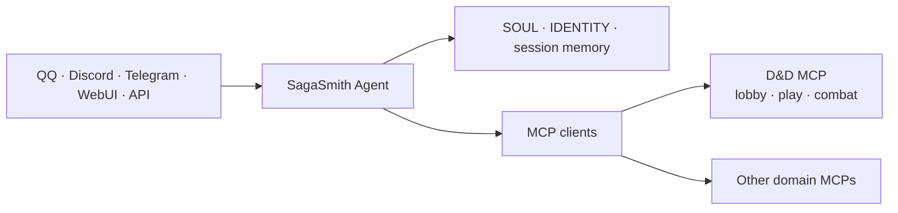

# SagaSmith Agent

[中文](README.md) · [English](README-en.md) · [官网](https://sagasmithai.github.io) · [平台总览](https://github.com/SagaSmithAI/.github/blob/main/profile/README.md) · [SagaSmith Web](https://github.com/SagaSmithAI/SagaSmith-Web) · [内容目录](https://github.com/SagaSmithAI/SagaSmith-dnd-content-library)

<p align="center"></p>

**SagaSmithAI 的身份、会话与多渠道 Agent Host。** 本项目基于 [NanoBot](https://github.com/HKUDS/nanobot)，连接模型、聊天渠道、workspace identity、记忆与 MCP 服务；领域规则、规则书、模组和战役数据库由独立 MCP 拥有。

> Agent 是坐在桌边的主持者，不是偷偷复制整个规则引擎的第二套后端。

## 平台职责



SagaSmith Agent 负责：

- **渠道与身份** — 把可信的 `channel:sender_id` 转为稳定 principal，并支持 pairing/allowlist。
- **Agent loop** — 多轮模型调用、原生工具、MCP tools/resources/prompts、流式回复和失败重连。
- **Workspace** — `SOUL.md`、`IDENTITY.md`、用户配置、Skills、artifact 和近期会话。
- **记忆** — session history、上下文压缩与 Dream consolidation；它与战役 Snapshot/actor knowledge 分开。
- **模型与提供商** — OpenAI-compatible、Responses API、Anthropic、Azure、Bedrock、Codex 等 provider adapter 与 preset/fallback。
- **多渠道** — QQ、NapCat、SnowLuma、Telegram、Discord、Slack、飞书、WhatsApp、微信、企业微信、钉钉、Matrix、Email、WebSocket、WebUI 等。
- **运行能力** — 定时任务、长期目标、subagent、文件/shell/web 工具、OpenAI-compatible API 与可选 WebUI。

它不负责：

- 直接读写 D&D/CoC 数据库或 Chroma collection；
- 在 Agent 仓库重新实现规则、战斗或模组解析；
- 用 `player_name` 或模型文本推断权限；
- 在存在匹配 MCP 能力时绕过 MCP 调 CLI/临时脚本。

## 先选择运行路径

| 目标 | 入口 | 状态与权限边界 | 从这里开始 |
|---|---|---|---|
| 自己电脑上的完整主持 Agent | `sagasmith-agent-local` / `nanobot` | 本地用户拥有 config、workspace、Channels 和所选 MCP | [Local Kit 安装](#windows-完整安装与启动) |
| SagaSmith Web 房间 | `sagasmith-agent-worker` | Web 是 Host/supervisor；worker 只接收一个可信 turn envelope 和一个玩家消息 | [Hosted Worker 契约](#hosted-worker-请求与结果契约) |
| Codex、Claude Code 或其他本地 Host | `sagasmith-auth-bridge` | 每个 requester/conversation 使用独立可信绑定；桥接器为目标 MCP 重新签发委派 | [Host Adapter](docs/sagasmith-host-adapters.md) |
| 通用 NanoBot 能力 | `nanobot` | 使用本仓库的 provider、channel、tool、WebUI 与 API 配置 | [文档索引](docs/README.md) |

Local Kit 与 Hosted Worker 复用同一个 Agent loop 和 MCP handler，但不是同一个安全
产品表面。Local 发行物允许用户选择本机能力；Hosted 发行物在构建后审计并移除
Channels、WebUI、本地安装器以及 shell/filesystem/web/cron/subagent 等工具。

## Local 与 Hosted 双发行物

仓库共享同一套 Agent loop、MCP client、Skills runtime 和 Auth Context 实现，但提供两个
明确的应用边界：

- `sagasmith-agent-local` / `Dockerfile`：用户直接运行的完整 Local Agent，包含 Channels、
  WebUI、本地栈管理以及按配置启用的 shell/filesystem/web/cron 能力。
- `sagasmith-agent-worker` / `Dockerfile.hosted`：Service 内部的每会话 Hosted Worker；配置
  必须声明 `tools.distribution="hosted"`，只装载会话 MCP 与 Service 注入的结构化输出/活动工具。

Hosted 镜像构建时会删除 Channel、WebUI、本地安装器和 Local CLI 表面，拒绝 Channel SDK，
并以非 root 用户运行。两个镜像由同一 CI 分别构建和审计，不维护第二份 Agent core。

Codex、Claude Code、上游 Nanobot、OpenClaw、Hermes 通过同一签名身份桥接协议连接三套
SagaSmith MCP；适配方式、信任边界和配置形状见
[外部 Host Auth Adapter](docs/sagasmith-host-adapters.md)。

### Hosted Worker 请求与结果契约

Web 只向 `POST /v1/chat/completions` 发送一条 `role=user` 的文本消息；可信字段必须放在
独立的 `trusted_context` 对象中，Pydantic 会拒绝额外字段、通配操作、重复操作、过期
委派以及超过 15 分钟的委派。关键字段包括：

```json
{
  "session_id": "service-session-id",
  "messages": [{"role": "user", "content": "玩家输入"}],
  "trusted_context": {
    "caller_principal": "workload:sagasmith-web",
    "workload_identity": "sagasmith-agent-hosted-worker",
    "requester_principal": "user:requester",
    "resource_owner_principal": "user:campaign-owner",
    "acting_host_principal": "campaign:gm",
    "acting_character_id": "character-id-or-empty",
    "authorized_audience": "player",
    "allowed_operations": ["campaign_query", "resolution"],
    "room_turn_id": "durable-room-turn-id",
    "campaign_id": "campaign-id",
    "system_id": "dnd5e",
    "base_revision": 42,
    "expires_at": "replace-with-now-plus-at-most-15-minutes",
    "idempotency_key": "stable-business-operation-key",
    "conversation_principal": "room:conversation",
    "tenant_id": "tenant-or-empty",
    "traceparent": "",
    "tracestate": "",
    "baggage": ""
  }
}
```

浏览器 token、Web callback token 和其他 audience 的凭据都不会下传到领域 MCP；Agent
针对目标服务、精确操作和剩余硬过期时间生成新委派。响应继续使用 OpenAI-compatible
外壳，并额外返回 `structured_output`、有界 `tool_receipts`、原始标准 `mcp_results` 和
Host-only `host_media`。`mcp_results[].result` 保留 MCP `CallToolResult` 的 text、image、
audio、resource、embedded resource、`structuredContent` 与 `isError` 语义；Web 将
`host_media` 转换为 artifact/对象存储 ID，而不是用私有 wire format 替代 MCP 结果。

## MCP 2026-07-28 与 Hosted 边界

内置发行锁要求 Python SDK v2 与 MCP 2026-07-28。通用 MCP 配置仍可用
`protocolMode: "auto"` 回退到 legacy initialize，`"legacy"` 只作为显式运维回滚。
现代路径不发送 `Mcp-Session-Id`；每次调用都携带与目标 MCP、
workload、requester、资源 owner、acting host/character、audience、具体操作、
`room_turn_id`、`base_revision` 和硬过期时间绑定的 `sagasmith.auth-context/v2`。
Hosted Worker 要求独立的 `SAGASMITH_WORKER_SERVICE_TOKEN`，玩家文本与可信上下文分字段，
并只连接当前 `system_id` 对应的 MCP。标准 MCP text/image/audio/resource/embedded-resource
结果保持不变，同时生成供 Web artifact 管道消费的 `host_media`。可信 supervisor 还必须为持久
workspace 传入稳定且唯一的 `--workspace-id`；worker 将它与规范路径绑定为 opaque owner，
从而让重试和重启在端口变化后仍安全复用原 workspace。

同一最新托管栈中的 D&D 与 CoC 参考战役已通过隔离客户端并发完成，未记录到回归
缺口；D&D 路径记录了一个合法结局。目录 runner 会把发现的全部模组、实际运行项和
exclusion 写入机器可读结果，因此这条证据不被扩张为所有 Pack 与剧情分支均已通关。

## D&D：MCP-first 主路径

[sagasmith-dnd](https://github.com/SagaSmithAI/sagasmith-dnd) 内的 D&D MCP 管理战役、规则、模组、角色、知识、分支、Snapshot 与战斗。现代目录对同一 authorization 保持确定、有序并使用 private cache hint；Agent 按当前 system、phase 和 task 只向模型暴露有界 facade 子集，每次调用仍由 MCP 重新校验身份、角色、阶段、revision 与具体 allowed operation。

```text
消息到达
→ Host 注入 principal
→ skill_query(read/search/section) 并读取 bounded Skill sections
→ 读取稳定、有界的 MCP 目录
→ 按 system / phase / task 选择精确 facade tool ID
→ 传递显式 campaign / revision / 服务器签发 guidance handle
→ 直接调用选中的原生 MCP 工具
→ MCP 校验 phase / campaign / role / actor / revision
→ 首次或变化的 host_context_binding 触发当前轮硬切换
→ isolated_evaluate / portray_npc 在全新零工具上下文中只生成提案
→ 结果写回会话与频道
```

现代目录不会因同一连接内其他请求的副作用而改变；authorization 仍可得到私有、确定的目录。legacy `tools/list_changed` 仅用于兼容和真实目录变化。目录筛选与 opaque handle 都不授予权限，模型不能靠构造参数提升权限。

### 防止工具列表过长

Hosted 路径采用三层筛选，避免把三个领域的全部低级工具一次性塞给模型：

1. 依据可信 `system_id` 只连接当前战役系统的 MCP；没有匹配 `systemIds` 的服务不启动。
2. MCP 为同一 authorization 提供稳定、确定排序、可缓存的目录，不依赖连接内的
   exposure 副作用改变 `tools/list`。
3. Web 按 system、phase、caller 权限和当前任务传入具体 `allowed_operations`；Agent
   校验这些 ID 确实存在后，只把对应 facade/workflow 子集放进本轮模型 registry。

`enabledTools` 是静态部署允许列表，`allowed_operations` 是单轮投影，两者都不能替代
领域 MCP 在每次调用时对 role、phase、campaign、revision 和幂等键的重新校验。
模型看不到的工具仍保留在稳定底层目录中，目录只有在 authorization/catalog 真正变化
时刷新，而不会因为一次战斗写入全量失效。

### MCP Tasks 只处理真正长工具

当且仅当现代 `server/discover` 协商得到 `io.modelcontextprotocol/tasks` 且一次工具调用
返回 `resultType: "task"` 时，Agent 才切换到 SEP-2663 claim/poll/update/cancel 流程。
每次 `tasks/get`、`tasks/update`、`tasks/cancel` 都使用新签名的单操作委派和
`Mcp-Name: <taskId>`；`taskId` 只是 opaque 名称，不是 capability。最终结果重新还原为
原工具的标准 `CallToolResult`。普通工具仍受 `toolTimeout` 控制并同步返回；只有真正的
import/OCR/compile/高分辨率 render 等长工具使用独立 `taskTimeout`。

战役、principal、role、audience、branch 或 restore 变化时，Agent 会停止同一
模型回复中余下的工具调用，丢弃旧模型消息、摘要、workspace/Dream memory、
缓存检索与旧 receipt，再从当前请求和可信 MCP 结果重建上下文。角色、受众、
阵营、来源解释和 DM ruling 使用固定 schema 的 `isolated_evaluate`，并可并发
评估彼此独立的签名 bundle；丰富的命名 NPC 对话继续使用 `portray_npc`。两者都
不带工具、不持久化子会话，也不直接产生权威状态。NPC bundle v2 携带 MCP
拥有的结构化对话和固定委派契约，而不是 Agent 渠道聊天记录。

### 可分享内容仍由 MCP 拥有

Agent 不解析或改写最终 `.sagasmith-pack`，也不缓存第二份怪物目录。规则书与模组书
只通过 Lobby 的 `rulebook_draft` / `module_draft` 进行机械首轮、Agent 审稿与定稿；
最终 Core Rules、Addon、Module、Preset Pack 只由 `content_pack` 管理。PC、NPC、
怪物的统一 actor card 只随最终 Preset 或 Module Pack 迁移。
导入返回新的 actor id；Agent 必须丢弃来源数据库 identity，且不得把旧会话、
workspace memory 或 actor knowledge 填进新角色。分享文件可作为聊天附件或
workspace artifact 传递，但只有 MCP 校验、白名单读取和公开写事务才能使其进入战役。

## Windows 完整安装与启动

需要 Windows 11、[uv](https://docs.astral.sh/uv/)、Python 3.11+，以及 Node.js 22.12+（含 npm）。把当前 SagaSmith 仓库放在同一个父目录；完整布局、组件职责和故障排查见 [Windows 全工作区安装指南](docs/guides/install-full-workspace-windows.zh-CN.md)。

```text
SagaSmith/
  SagaSmith-agent/              # Agent、渠道与 WebUI
  sagasmith-core/               # 通用持久化与 Pack 基础设施
  sagasmith-dnd/                # D&D Domain、MCP、Skills、UI 与模组生成
  sagasmith-coc/                # CoC Domain、MCP、Skills、UI 与模组生成
  sagasmith-narrative/          # Narrative Domain、MCP、Skills 与项目生成
  SagaSmith-dnd-content-library/# 公开、逐包许可约束的 Pack 目录（可选）
```

三个领域仓库是当前 Domain、MCP、Skills、UI（如有）和生成流程的唯一源码入口。
原独立 MCP、Skills、UI 与通用 Module Generator 仓库已归档；安装器不会读取它们，
也不会把它们作为兼容回退。

内置 `sagasmith.release-lock/v3` 把 Core 与三个当前领域仓库固定到已审计的不可变
commit，并把 MCP 2026-07-28、auth-context v2 与共享 authority contract 记录为必需
兼容元数据。未知组件会被拒绝，因此归档拆分仓库不能静默进入发布输入。
该 manifest 是尚未发布的兼容锁，不代表 release 公告或 tag。

从 Agent 仓库选择正式发行 profile；`--mode` 仍可自由组合，不传两者时等同
`multi-system`：

```powershell
cd SagaSmith-agent
uv run nanobot sagasmith install --profile dnd-only
uv run nanobot sagasmith install --profile coc-only
uv run nanobot sagasmith install --profile narrative-only
uv run nanobot sagasmith install --profile multi-system
uv run nanobot sagasmith install --mode coc --mode narrative
uv run nanobot sagasmith install
```

`sagasmith-local-kit.json` 固定 profile、组件、端口、模板与公共
`sagasmith.authoritative-mcp/v2` 契约。每个 profile 都可选择 `--transport stdio`
（一个客户端独占进程）、`--transport streamable-http`（多个本机客户端共享常驻进程）
或默认 `mixed`。两种 transport 使用相同 handlers、schemas、错误、revision、
idempotency 与 authority 语义。HTTP 只监听 loopback。

Python 安装器让 D&D、CoC、Narrative 保持独立可选，只维护 SagaSmith 自己的配置字段并仅构建所选 UI。它不会导入或激活 Pack，也不依赖 SagaSmith Web、PostgreSQL、Redis、对象存储、账户、quota 或 Forge。

安装后配置 repo-local Agent：

```powershell
uv run nanobot onboard --wizard --config config\config.json --workspace workspace
```

再按 [MCP 配置指南](docs/guides/configure-mcp-tools.md) 配置 provider、model preset 与 channel。随时可重新审计：

```powershell
uv run nanobot sagasmith install --verify-only
uv run nanobot sagasmith doctor --json
```

doctor 分别报告 MCP/config、领域数据库、Skills、provider 与所选 transport；provider
未配置时是 readiness 警告，不会伪装成安装损坏。Discord、QQ、Telegram Bot 以及
Codex、Claude Code、OpenClaw/通用 Agent 的无凭证模板位于
[`examples/local-agent-kit`](examples/local-agent-kit/README.md)。

本地性能基线不会调用 LLM，也不会打开现有 campaign 数据。它在临时目录逐个启动
loopback MCP，并测量 cold start、同一 session 内的 warm `server_capabilities` 调用和
idle RSS：

```powershell
uv run nanobot sagasmith benchmark --profile dnd-only --iterations 5 --json
```

D&D 与 CoC 的用户友好 embedding cache 路径会分别映射到 Core 使用的
`DND5E_EMBEDDING_CACHE_DIR` 与 `COC7_EMBEDDING_CACHE_DIR`。Narrative 模板中的 cache
路径只是预留项；当前 Narrative runtime 不使用 Core embedder，不能据此认为缓存已启用。

安装器只同步 Agent base 与所选 MCP；D&D/CoC 仅在 HTTP profile 中增加 `gateway` extra，
不会安装所有 Agent channel extra。需要 Bot 时在安装后显式选择，例如
`uv sync --extra discord`、`--extra qq` 或 `--extra telegram`。领域 MCP 当前声明的
documents/OCR 依赖仍按各自 package contract 安装。

配置通过后，启动所选权威服务、Workbench 与 Agent：

```powershell
uv run nanobot sagasmith start
```

公开目录当前只包含具备再分发许可的 SRD Pack。完整私有内容库必须由用户拥有的规则书/模组在本地通过最新 draft → Agent review → finalize 流程构建；安装器不复制商业书籍、不生成私有 Pack，也不替用户选择 campaign activation。最终导入与激活属于 Lobby 的内容控制流程。

D&D 与 CoC Workbench 默认位于 8766 与 8768。非本机访问必须设置 bearer token 和显式 origin allowlist；无 token 时 gateway 拒绝所有非 loopback 请求。

> `config/config.json` 通常包含本机路径与密钥，不应提交。使用环境变量引用 provider secret。

## Hosted workspace 生命周期

`sagasmith-agent-worker` 必须由可信 supervisor 传入 `--workspace`、稳定且唯一的
`--workspace-id` 与配置路径。默认策略为 TTL 86400 秒、单 workspace 1 GiB、同一 root
最多 128 个登记 workspace，可通过 `--workspace-ttl-seconds`、
`--workspace-max-bytes`、`--workspace-max-count` 收紧。

worker 在 workspace 中写入 `sagasmith.hosted-workspace/v1` marker，将规范路径与
Host 管理的 ID 哈希为稳定 opaque owner。重试或进程重启可重新认领同一 owner；请求的
`terminal=true` 先标记终止，随后才进入 TTL/LRU 清理。清理只删除 root 下、marker
schema/路径匹配且处于 `terminated` 状态的目录；未知目录、active workspace、symlink、
损坏或不匹配 marker 都会保留。不要让多个 workspace 复用同一个 ID，也不要用玩家或
模型文本生成 ID。

## 通用快速开始

Python 3.11+：

```bash
uv sync
uv run nanobot onboard --wizard
uv run nanobot status
uv run nanobot agent -m "Hello"
```

或在受控虚拟环境中：

```bash
python -m pip install -e .
nanobot onboard --wizard
nanobot gateway
```

初始化默认创建 `~/.nanobot/config.json` 与 `~/.nanobot/workspace/`。统一本地栈命令可通过 `--config` 和 `SAGASMITH_LOCAL_HOME` 使用 repo-local 配置与状态目录。

## MCP 配置原则

```json
{
  "tools": {
    "mcpServers": {
      "example": {
        "command": "path-to-server",
        "args": [],
        "toolTimeout": 60,
        "injectPrincipal": true,
        "enabledTools": ["narrow", "explicit", "allowlist"]
      }
    }
  }
}
```

- stdio MCP 适合可信本地服务；HTTP/SSE 受 SSRF guard 保护，私网地址必须最小范围 allowlist。
- `enabledTools` 是 Host 外层允许列表；领域内的 phase/role/exposure 应由服务端继续收窄。
- `injectPrincipal` 只隐藏/注入调用者字段，不隐藏授权目标字段。
- MCP domains 拥有其持久化和 Skills；Agent workspace 只保留人格、会话和跨领域编排。
- 最终统一 Pack 是 domain content，不是 Host session memory 或权限载体。

## 记忆分层

| 层 | 所有者 | 用途 |
|---|---|---|
| Session history | SagaSmith Agent | 当前聊天的近期连续性 |
| Dream/compaction | SagaSmith Agent | 压缩长对话，保留工作上下文 |
| Campaign Snapshot/branch | D&D/CoC runtime | 可恢复的权威世界状态与时间线 |
| Campaign memory | Domain MCP/Core | 跨 session、分支感知的长期事实 |
| Actor knowledge | Domain MCP/Core | 每个 PC/NPC 独立的所知事实与可见边界 |

进入 domain-authoritative 战役上下文后，workspace/Dream memory 不进入模型
提示；战役消息标为 `campaign_private`，只留在对应 session。Agent 摘要不能
替代后四者，也不应把隐藏 GM 内容写进玩家可见 session。

## 开发

```bash
uv sync --all-extras
uv run pytest
uv run ruff check nanobot tests

cd webui
bun install
bun run build
bun run test
```

### 聚焦验证

README、MCP/Hosted 配置或发布锁变更至少应运行：

```bash
uv run ruff check nanobot tests
uv run pytest -q tests/apps/test_hosted_worker.py tests/tools/test_mcp_v2_contract.py \
  tests/tools/test_mcp_tasks.py tests/test_sagasmith_local_stack.py
uv run pytest -q tests/host_conformance
```

真实领域矩阵由 CI 的 `release-lock` 与 `latest-main` 两条 lane 运行；本地测试不得使用
生产战役数据、真实用户文本或付费模型。`python -m nanobot.apps.hosted_audit` 只在仅安装
`.[hosted]` 的干净 Hosted 镜像中运行；装有 Channel extras 的 Local/dev 环境会按设计失败。

## 部署、升级与回滚

1. 先读取 [`sagasmith-stack-lock.json`](sagasmith-stack-lock.json)，确认 schema 为
   `sagasmith.release-lock/v3`、`release_status` 仍符合预期，并按其中的不可变 commit
   部署 Core 与三个领域组件；不要从归档仓库或浮动 `main` 拼装正式栈。
2. 先运行 `nanobot sagasmith install --verify-only` 与 `nanobot sagasmith doctor --json`，
   再滚动替换领域 MCP、Agent Worker，最后替换 Web。保持旧镜像和旧 lock 可用，直到
   新栈的真实 transport/identity/media/Tasks smoke 通过。
3. 协议故障可把单个通用 MCP 配置临时设为 `protocolMode: "legacy"`；协调发行栈应优先
   整体回滚到上一组已验证镜像和 lock。legacy 只是兼容适配，不恢复隐式 session 权限，
   也不得启用已归档仓库。
4. Hosted 请求契约不兼容时先回滚 Agent 镜像，再回滚 Web pin。不要在运行中改变
   `workspace-id` 的归属，也不要用目录清空代替 marker/TTL/LRU 生命周期。

Hosted Worker 的 `/health` 用于存活检查；`GET /metrics/mcp` 返回
`sagasmith.host-mcp-metrics/v1`，只按 transport、协议时代、阶段、结果及固定目录数量桶
聚合。`traceparent`、`tracestate`、`baggage` 随可信请求向 MCP 传播，但 user、campaign、
run、tool name 和参数都不会成为 metric label。模型调用层的 Langfuse 是可选项，不能
替代 worker/MCP 的低基数运行指标。

上线前同时复核 [`SECURITY.md`](SECURITY.md)、
[`docs/sagasmith-host-adapters.md`](docs/sagasmith-host-adapters.md) 和
[`docs/deployment.md`](docs/deployment.md)。不要把 `SAGASMITH_WORKER_SERVICE_TOKEN`、
MCP 签名 secret、provider key、可信 context 文件或填充后的 Local Kit 模板提交到 Git。

常用文档：[Quick Start](docs/quick-start.md) · [Configuration](docs/configuration.md) · [Architecture](docs/architecture.md) · [MCP](docs/guides/configure-mcp-tools.md) · [Security](SECURITY.md)

## 状态与许可

项目处于 Alpha。SagaSmith-specific 代码使用 Apache-2.0；NanoBot 上游代码及其他第三方组件保留各自许可、署名与 notices，详见 [THIRD_PARTY_NOTICES.md](THIRD_PARTY_NOTICES.md)。
