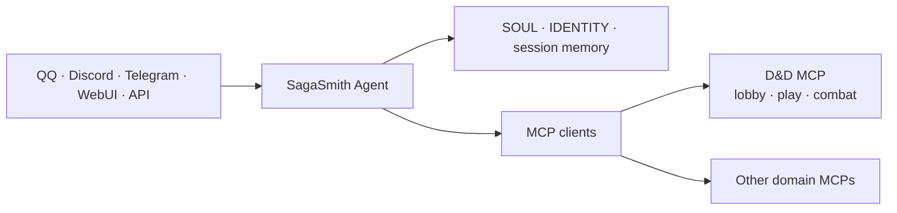

# SagaSmith Agent

[中文](README.md) · [English](README-en.md) · [官网](https://sagasmithai.github.io) · [平台总览](https://github.com/SagaSmithAI/.github/blob/main/profile/README.md) · [SagaSmith Web](https://github.com/SagaSmithAI/SagaSmith-service) · [内容目录](https://github.com/SagaSmithAI/SagaSmith-dnd-content-library)

<p align="center"></p>

**SagaSmithAI 的身份、会话与多渠道 Agent Host。** 本项目基于 [NanoBot](https://github.com/HKUDS/nanobot)，连接模型、聊天渠道、workspace identity、记忆与 MCP 服务；领域规则、规则书、模组和战役数据库由独立 MCP 拥有。

> Agent 是坐在桌边的主持者，不是偷偷复制整个规则引擎的第二套后端。

## 平台职责



SagaSmith Agent 负责：

- **渠道与身份** — 把可信的 `channel:sender_id` 转为稳定 principal，并支持 pairing/allowlist。
- **Agent loop** — 多轮模型调用、原生工具、MCP tools/resources/prompts、流式回复和失败重连。
- **Workspace** — `SOUL.md`、`IDENTITY.md`、用户配置、Skills、artifact 和近期会话。
- **记忆** — session history、上下文压缩与 Dream consolidation；它与战役 Snapshot/actor knowledge 分开。
- **模型与提供商** — OpenAI-compatible、Responses API、Anthropic、Azure、Bedrock、Codex 等 provider adapter 与 preset/fallback。
- **多渠道** — QQ、NapCat、SnowLuma、Telegram、Discord、Slack、飞书、WhatsApp、微信、企业微信、钉钉、Matrix、Email、WebSocket、WebUI 等。
- **运行能力** — 定时任务、长期目标、subagent、文件/shell/web 工具、OpenAI-compatible API 与可选 WebUI。

它不负责：

- 直接读写 D&D/CoC 数据库或 Chroma collection；
- 在 Agent 仓库重新实现规则、战斗或模组解析；
- 用 `player_name` 或模型文本推断权限；
- 在存在匹配 MCP 能力时绕过 MCP 调 CLI/临时脚本。

## Local 与 Hosted 双发行物

仓库共享同一套 Agent loop、MCP client、Skills runtime 和 Auth Context 实现，但提供两个
明确的应用边界：

- `sagasmith-agent-local` / `Dockerfile`：用户直接运行的完整 Local Agent，包含 Channels、
  WebUI、本地栈管理以及按配置启用的 shell/filesystem/web/cron 能力。
- `sagasmith-agent-worker` / `Dockerfile.hosted`：Service 内部的每会话 Hosted Worker；配置
  必须声明 `tools.distribution="hosted"`，只装载会话 MCP 与 Service 注入的结构化输出/活动工具。

Hosted 镜像构建时会删除 Channel、WebUI、本地安装器和 Local CLI 表面，拒绝 Channel SDK，
并以非 root 用户运行。两个镜像由同一 CI 分别构建和审计，不维护第二份 Agent core。

Codex、Claude Code、上游 Nanobot、OpenClaw、Hermes 通过同一签名身份桥接协议连接三套
SagaSmith MCP；适配方式、信任边界和配置形状见
[外部 Host Auth Adapter](docs/sagasmith-host-adapters.md)。

## MCP 2026-07-28 与 Hosted 边界

Agent 使用 Python SDK v2 的 `protocolMode: "auto"` 同时兼容 legacy initialize 与
MCP 2026-07-28 discover。现代路径不发送 `Mcp-Session-Id`；每次调用都携带与目标 MCP、
workload、requester、资源 owner、acting host/character、audience、具体操作、
`room_turn_id`、`base_revision` 和硬过期时间绑定的 `sagasmith.auth-context/v2`。
Hosted Worker 要求独立的 `SAGASMITH_WORKER_SERVICE_TOKEN`，玩家文本与可信上下文分字段，
并只连接当前 `system_id` 对应的 MCP。标准 MCP text/image/audio/resource/embedded-resource
结果保持不变，同时生成供 Web artifact 管道消费的 `host_media`。

同一最新托管栈中的 D&D 与 CoC 参考战役已通过隔离客户端并发完成，未记录到回归
缺口；D&D 路径记录了一个合法结局。目录 runner 会把发现的全部模组、实际运行项和
exclusion 写入机器可读结果，因此这条证据不被扩张为所有 Pack 与剧情分支均已通关。

## D&D：MCP-first 主路径

[sagasmith-dnd](https://github.com/SagaSmithAI/sagasmith-dnd) 内的 D&D MCP 管理战役、规则、模组、角色、知识、分支、Snapshot 与战斗。每个聊天会话在服务端单独打开 exposure；服务端按当前 session、principal、campaign 与 phase 过滤原生工具列表，Agent 只选择当前任务所需的精确工具。

```text
消息到达
→ Host 注入 principal
→ skill_query(read/search/section) 并读取 bounded Skill sections
→ exposure(action="open")
→ exposure(action="search" / "set")
→ tools/list_changed 后刷新原生 schema
→ 直接调用列表中的原生 MCP 工具
→ MCP 校验 phase / campaign / role / actor / revision
→ 首次或变化的 host_context_binding 触发当前轮硬切换
→ isolated_evaluate / portray_npc 在全新零工具上下文中只生成提案
→ 结果写回会话与频道
```

因此同一个 D&D MCP 进程可以为不同频道、用户与战役维护不同的可见工具面，模型不能靠构造参数提升权限。

战役、principal、role、audience、branch 或 restore 变化时，Agent 会停止同一
模型回复中余下的工具调用，丢弃旧模型消息、摘要、workspace/Dream memory、
缓存检索与旧 receipt，再从当前请求和可信 MCP 结果重建上下文。角色、受众、
阵营、来源解释和 DM ruling 使用固定 schema 的 `isolated_evaluate`，并可并发
评估彼此独立的签名 bundle；丰富的命名 NPC 对话继续使用 `portray_npc`。两者都
不带工具、不持久化子会话，也不直接产生权威状态。NPC bundle v2 携带 MCP
拥有的结构化对话和固定委派契约，而不是 Agent 渠道聊天记录。

### 可分享内容仍由 MCP 拥有

Agent 不解析或改写最终 `.sagasmith-pack`，也不缓存第二份怪物目录。规则书与模组书
只通过 Lobby 的 `rulebook_draft` / `module_draft` 进行机械首轮、Agent 审稿与定稿；
最终 Core Rules、Addon、Module、Preset Pack 只由 `content_pack` 管理。PC、NPC、
怪物的统一 actor card 只随最终 Preset 或 Module Pack 迁移。
导入返回新的 actor id；Agent 必须丢弃来源数据库 identity，且不得把旧会话、
workspace memory 或 actor knowledge 填进新角色。分享文件可作为聊天附件或
workspace artifact 传递，但只有 MCP 校验、白名单读取和公开写事务才能使其进入战役。

## Windows 完整安装与启动

需要 Windows 11、[uv](https://docs.astral.sh/uv/)、Python 3.11+，以及 Node.js 22.12+（含 npm）。把当前 SagaSmith 仓库放在同一个父目录；完整布局、组件职责和故障排查见 [Windows 全工作区安装指南](docs/guides/install-full-workspace-windows.zh-CN.md)。

```text
SagaSmith/
  SagaSmith-agent/              # Agent、渠道与 WebUI
  sagasmith-core/               # 通用持久化与 Pack 基础设施
  sagasmith-dnd/                # D&D Domain、MCP、Skills、UI 与模组生成
  sagasmith-coc/                # CoC Domain、MCP、Skills、UI 与模组生成
  sagasmith-narrative/          # Narrative Domain、MCP、Skills 与项目生成
  SagaSmith-dnd-content-library/# 公开、逐包许可约束的 Pack 目录（可选）
```

三个领域仓库是当前 Domain、MCP、Skills、UI（如有）和生成流程的唯一源码入口。
原独立 MCP、Skills、UI 与通用 Module Generator 仓库已归档；安装器不会读取它们，
也不会把它们作为兼容回退。

从 Agent 仓库选择正式发行 profile；`--mode` 仍可自由组合，不传两者时等同
`multi-system`：

```powershell
cd SagaSmith-agent
uv run nanobot sagasmith install --profile dnd-only
uv run nanobot sagasmith install --profile coc-only
uv run nanobot sagasmith install --profile narrative-only
uv run nanobot sagasmith install --profile multi-system
uv run nanobot sagasmith install --mode coc --mode narrative
uv run nanobot sagasmith install
```

`sagasmith-local-kit.json` 固定 profile、组件、端口、模板与公共
`sagasmith.authoritative-mcp/v1` 契约。每个 profile 都可选择 `--transport stdio`
（一个客户端独占进程）、`--transport streamable-http`（多个本机客户端共享常驻进程）
或默认 `mixed`。两种 transport 使用相同 handlers、schemas、错误、revision、
idempotency 与 authority 语义。HTTP 只监听 loopback。

Python 安装器让 D&D、CoC、Narrative 保持独立可选，只维护 SagaSmith 自己的配置字段并仅构建所选 UI。它不会导入或激活 Pack，也不依赖 SagaSmith Web、PostgreSQL、Redis、对象存储、账户、quota 或 Forge。

安装后配置 repo-local Agent：

```powershell
uv run nanobot onboard --wizard --config config\config.json --workspace workspace
```

再按 [MCP 配置指南](docs/guides/configure-mcp-tools.md) 配置 provider、model preset 与 channel。随时可重新审计：

```powershell
uv run nanobot sagasmith install --verify-only
uv run nanobot sagasmith doctor --json
```

doctor 分别报告 MCP/config、领域数据库、Skills、provider 与所选 transport；provider
未配置时是 readiness 警告，不会伪装成安装损坏。Discord、QQ、Telegram Bot 以及
Codex、Claude Code、OpenClaw/通用 Agent 的无凭证模板位于
[`examples/local-agent-kit`](examples/local-agent-kit/README.md)。

本地性能基线不会调用 LLM，也不会打开现有 campaign 数据。它在临时目录逐个启动
loopback MCP，并测量 cold start、同一 session 内的 warm `server_capabilities` 调用和
idle RSS：

```powershell
uv run nanobot sagasmith benchmark --profile dnd-only --iterations 5 --json
```

D&D 与 CoC 的用户友好 embedding cache 路径会分别映射到 Core 使用的
`DND5E_EMBEDDING_CACHE_DIR` 与 `COC7_EMBEDDING_CACHE_DIR`。Narrative 模板中的 cache
路径只是预留项；当前 Narrative runtime 不使用 Core embedder，不能据此认为缓存已启用。

安装器只同步 Agent base 与所选 MCP；D&D/CoC 仅在 HTTP profile 中增加 `gateway` extra，
不会安装所有 Agent channel extra。需要 Bot 时在安装后显式选择，例如
`uv sync --extra discord`、`--extra qq` 或 `--extra telegram`。领域 MCP 当前声明的
documents/OCR 依赖仍按各自 package contract 安装。

配置通过后，启动所选权威服务、Workbench 与 Agent：

```powershell
uv run nanobot sagasmith start
```

公开目录当前只包含具备再分发许可的 SRD Pack。完整私有内容库必须由用户拥有的规则书/模组在本地通过最新 draft → Agent review → finalize 流程构建；安装器不复制商业书籍、不生成私有 Pack，也不替用户选择 campaign activation。最终导入与激活属于 Lobby 的内容控制流程。

D&D 与 CoC Workbench 默认位于 8766 与 8768。非本机访问必须设置 bearer token 和显式 origin allowlist；无 token 时 gateway 拒绝所有非 loopback 请求。

> `config/config.json` 通常包含本机路径与密钥，不应提交。使用环境变量引用 provider secret。

## 通用快速开始

Python 3.11+：

```bash
uv sync
uv run nanobot onboard --wizard
uv run nanobot status
uv run nanobot agent -m "Hello"
```

或在受控虚拟环境中：

```bash
python -m pip install -e .
nanobot onboard --wizard
nanobot gateway
```

初始化默认创建 `~/.nanobot/config.json` 与 `~/.nanobot/workspace/`。统一本地栈命令可通过 `--config` 和 `SAGASMITH_LOCAL_HOME` 使用 repo-local 配置与状态目录。

## MCP 配置原则

```json
{
  "tools": {
    "mcpServers": {
      "example": {
        "command": "path-to-server",
        "args": [],
        "toolTimeout": 60,
        "injectPrincipal": true,
        "enabledTools": ["narrow", "explicit", "allowlist"]
      }
    }
  }
}
```

- stdio MCP 适合可信本地服务；HTTP/SSE 受 SSRF guard 保护，私网地址必须最小范围 allowlist。
- `enabledTools` 是 Host 外层允许列表；领域内的 phase/role/exposure 应由服务端继续收窄。
- `injectPrincipal` 只隐藏/注入调用者字段，不隐藏授权目标字段。
- MCP domains 拥有其持久化和 Skills；Agent workspace 只保留人格、会话和跨领域编排。
- 最终统一 Pack 是 domain content，不是 Host session memory 或权限载体。

## 记忆分层

| 层 | 所有者 | 用途 |
|---|---|---|
| Session history | SagaSmith Agent | 当前聊天的近期连续性 |
| Dream/compaction | SagaSmith Agent | 压缩长对话，保留工作上下文 |
| Campaign Snapshot/branch | D&D/CoC runtime | 可恢复的权威世界状态与时间线 |
| Campaign memory | Domain MCP/Core | 跨 session、分支感知的长期事实 |
| Actor knowledge | Domain MCP/Core | 每个 PC/NPC 独立的所知事实与可见边界 |

进入 domain-authoritative 战役上下文后，workspace/Dream memory 不进入模型
提示；战役消息标为 `campaign_private`，只留在对应 session。Agent 摘要不能
替代后四者，也不应把隐藏 GM 内容写进玩家可见 session。

## 开发

```bash
uv sync --all-extras
uv run pytest
uv run ruff check nanobot tests

cd webui
bun install
bun run build
bun run test
```

常用文档：[Quick Start](docs/quick-start.md) · [Configuration](docs/configuration.md) · [Architecture](docs/architecture.md) · [MCP](docs/guides/configure-mcp-tools.md) · [Security](SECURITY.md)

## 状态与许可

项目处于 Alpha。SagaSmith-specific 代码使用 Apache-2.0；NanoBot 上游代码及其他第三方组件保留各自许可、署名与 notices，详见 [THIRD_PARTY_NOTICES.md](THIRD_PARTY_NOTICES.md)。
