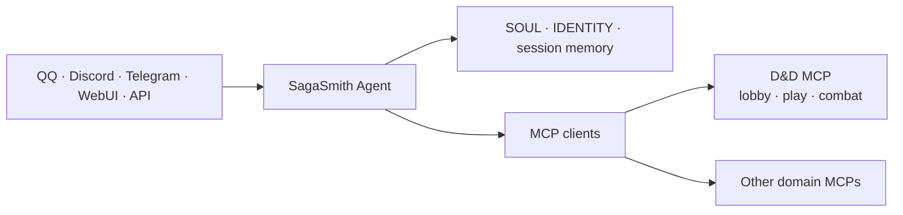

# SagaSmith Agent

[中文](README.md) · [English](README-en.md) · [平台总览](https://github.com/SagaSmithAI/.github/blob/main/profile/README.md)

<p align="center"></p>

**SagaSmithAI 的身份、会话与多渠道 Agent Host。** 本项目基于 [NanoBot](https://github.com/HKUDS/nanobot)，连接模型、聊天渠道、workspace identity、记忆与 MCP 服务；领域规则、规则书、模组和战役数据库由独立 MCP 拥有。

> Agent 是坐在桌边的主持者，不是偷偷复制整个规则引擎的第二套后端。

## 平台职责



SagaSmith Agent 负责：

- **渠道与身份** — 把可信的 `channel:sender_id` 转为稳定 principal，并支持 pairing/allowlist。
- **Agent loop** — 多轮模型调用、原生工具、MCP tools/resources/prompts、流式回复和失败重连。
- **Workspace** — `SOUL.md`、`IDENTITY.md`、用户配置、Skills、artifact 和近期会话。
- **记忆** — session history、上下文压缩与 Dream consolidation；它与战役 Snapshot/actor knowledge 分开。
- **模型与提供商** — OpenAI-compatible、Responses API、Anthropic、Azure、Bedrock、Codex 等 provider adapter 与 preset/fallback。
- **多渠道** — QQ、NapCat、SnowLuma、Telegram、Discord、Slack、飞书、WhatsApp、微信、企业微信、钉钉、Matrix、Email、WebSocket、WebUI 等。
- **运行能力** — 定时任务、长期目标、subagent、文件/shell/web 工具、OpenAI-compatible API 与可选 WebUI。

它不负责：

- 直接读写 D&D/CoC 数据库或 Chroma collection；
- 在 Agent 仓库重新实现规则、战斗或模组解析；
- 用 `player_name` 或模型文本推断权限；
- 在存在匹配 MCP 能力时绕过 MCP 调 CLI/临时脚本。

## D&D：MCP-first 主路径

[SagaSmith D&D MCP](https://github.com/SagaSmithAI/SagaSmith-dnd-mcp) 管理战役、规则、模组、角色、知识、分支、Snapshot 与战斗。Agent 只常驻其 13 个 exposure/诊断/有界 Skill 读取工具；每个聊天会话在服务端单独打开 exposure，按任务加载 `lobby`、`play` 或 `combat` 能力组。

```text
消息到达
→ Host 注入 principal
→ skill_query(plan) 并读取 required_now
→ exposure_open
→ search / inspect / load，并读取 skill_plan_delta
→ exposure_call（NanoBot 静态 schema fallback）
→ MCP 校验 phase / campaign / role / actor / revision
→ 首次或变化的 host_context_binding 触发当前轮硬切换
→ isolated_evaluate / portray_npc 在全新零工具上下文中只生成提案
→ 结果写回会话与频道
```

因此同一个 D&D MCP 进程可以为不同频道、用户与战役维护不同的可见工具面，模型不能靠构造参数提升权限。

战役、principal、role、audience、branch 或 restore 变化时，Agent 会停止同一
模型回复中余下的工具调用，丢弃旧模型消息、摘要、workspace/Dream memory、
缓存检索与旧 receipt，再从当前请求和可信 MCP 结果重建上下文。角色、受众、
阵营、来源解释和 DM ruling 使用固定 schema 的 `isolated_evaluate`；丰富的命名
NPC 对话继续使用 `portray_npc`。两者都不带工具、不持久化子会话，也不直接
产生权威状态。

## Windows 一键启动当前工作区

仓库根目录的 [`start.bat`](start.bat) 是 Agent + D&D MCP + D&D UI Gateway 的单一入口。D&D MCP 使用 stdio，由 NanoBot 根据配置启动为子进程；脚本同时在 `127.0.0.1:8766` 启动 principal-aware HTTP/SSE adapter，供 D&D UI 观察权威状态与提交受 MCP 校验的战斗移动。

准备相邻仓库：

```text
SagaSmith/
  SagaSmith-agent/
  SagaSmith-dnd-mcp/
  SagaSmith-dnd-skills/
  SagaSmith-module-gen-skills/
  reference/DnD-Books/
```

安装：

```powershell
cd SagaSmith-dnd-mcp
uv sync --all-extras

cd ..\SagaSmith-coc-mcp
uv sync --all-extras

cd ..\SagaSmith-agent
uv sync --all-extras
```

然后按 [配置指南](docs/guides/configure-mcp-tools.md) 创建或检查 `config/config.json` 中的 provider、model preset、channel，以及 `tools.mcpServers.sagasmith_dnd` / `sagasmith_coc`，运行：

```powershell
.\start.bat
```

脚本会检查 `uv`、Agent 配置、Full D&D Skills 暴露及 phase plan、D&D
核心工具清单、900 秒 PDF 超时、规则书与战役模组两个独立 allowlist，
以及两个相邻 MCP executable，创建各自的 workspace MCP home，先等待 D&D
UI Gateway 健康检查通过，再以前台启动 Agent gateway；退出 Agent 时会
清理 UI Gateway 子进程。详细配置见
[configure-mcp-tools](docs/guides/configure-mcp-tools.md)。

UI 默认连接 `http://127.0.0.1:8766`。若要从非本机访问，必须设置 `SAGASMITH_DND_GATEWAY_TOKEN`、显式 origin allowlist 与 UI 对应 token；无 token 时 gateway 拒绝所有非 loopback 请求。

> `config/config.json` 通常包含本机路径与密钥，不应提交。使用环境变量引用 provider secret。

## 通用快速开始

Python 3.11+：

```bash
uv sync
uv run nanobot onboard --wizard
uv run nanobot status
uv run nanobot agent -m "Hello"
```

或在受控虚拟环境中：

```bash
python -m pip install -e .
nanobot onboard --wizard
nanobot gateway
```

初始化默认创建 `~/.nanobot/config.json` 与 `~/.nanobot/workspace/`。本仓库的 `start.bat` 使用 repo-local `config/config.json` 和 `workspace/`，适合 SagaSmith 整体工作区。

## MCP 配置原则

```json
{
  "tools": {
    "mcpServers": {
      "example": {
        "command": "path-to-server",
        "args": [],
        "toolTimeout": 60,
        "injectPrincipal": true,
        "enabledTools": ["narrow", "explicit", "allowlist"]
      }
    }
  }
}
```

- stdio MCP 适合可信本地服务；HTTP/SSE 受 SSRF guard 保护，私网地址必须最小范围 allowlist。
- `enabledTools` 是 Host 外层允许列表；领域内的 phase/role/exposure 应由服务端继续收窄。
- `injectPrincipal` 只隐藏/注入调用者字段，不隐藏授权目标字段。
- MCP domains 拥有其持久化和 Skills；Agent workspace 只保留人格、会话和跨领域编排。

## 记忆分层

| 层 | 所有者 | 用途 |
|---|---|---|
| Session history | SagaSmith Agent | 当前聊天的近期连续性 |
| Dream/compaction | SagaSmith Agent | 压缩长对话，保留工作上下文 |
| Campaign Snapshot/branch | D&D/CoC runtime | 可恢复的权威世界状态与时间线 |
| Campaign memory | Domain MCP/Core | 跨 session、分支感知的长期事实 |
| Actor knowledge | Domain MCP/Core | 每个 PC/NPC 独立的所知事实与可见边界 |

进入 domain-authoritative 战役上下文后，workspace/Dream memory 不进入模型
提示；战役消息标为 `campaign_private`，只留在对应 session。Agent 摘要不能
替代后四者，也不应把隐藏 GM 内容写进玩家可见 session。

## 开发

```bash
uv sync --all-extras
uv run pytest
uv run ruff check nanobot tests

cd webui
bun install
bun run build
bun run test
```

常用文档：[Quick Start](docs/quick-start.md) · [Configuration](docs/configuration.md) · [Architecture](docs/architecture.md) · [MCP](docs/guides/configure-mcp-tools.md) · [Security](SECURITY.md)

## 状态与许可

项目处于 Alpha。SagaSmith-specific 代码使用 Apache-2.0；NanoBot 上游代码及其他第三方组件保留各自许可、署名与 notices，详见 [THIRD_PARTY_NOTICES.md](THIRD_PARTY_NOTICES.md)。
